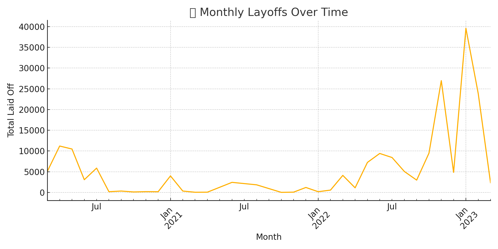
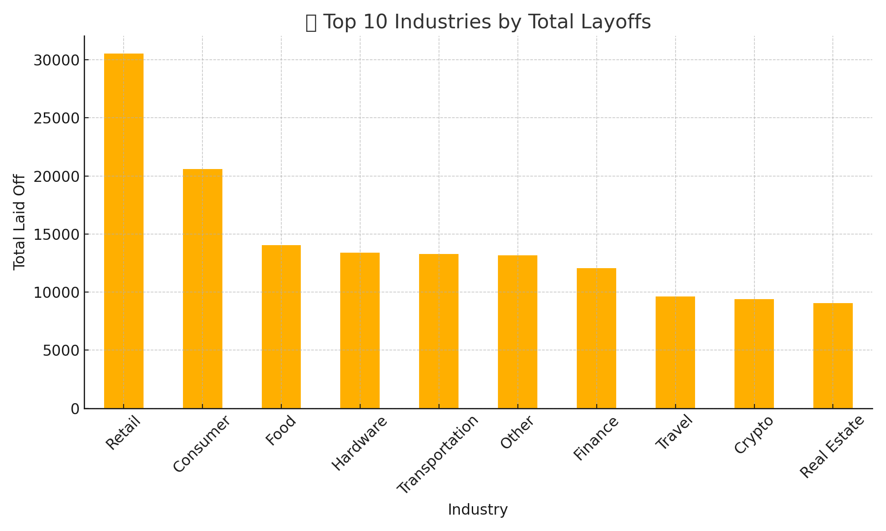

# 🧹 SQL Data Cleaning Project – Layoffs Dataset

This project demonstrates real-world data cleaning using SQL on a tech layoffs dataset. 
It includes identifying and removing duplicates, handling nulls, standardizing data, and exporting a cleaned version of the dataset.

## 🗂 Files
- `layoffs.csv` – Original raw data
- `Data Cleaning.sql` – SQL queries for cleaning
- `cleaned_layoffs.csv` – Final cleaned dataset

## 🔧 What’s Covered in SQL
- Duplicate removal using `ROW_NUMBER()` and CTEs
- Text standardization with `TRIM()`, `LIKE`, and `UPDATE`
- Handling null/missing values
- Column formatting and date conversion

## 💡 Skills Demonstrated
- SQL data wrangling
- Use of CTEs and window functions
- String and date manipulations
- Real-world ETL logic for business data

## ✅ How to Use
You can run the SQL file step-by-step in MySQL Workbench or DBeaver to clean the dataset yourself.  
The final result is also exported as `cleaned_layoffs.csv`.

## 📊 Exploratory Data Analysis (EDA)

After cleaning the dataset, I conducted an exploratory data analysis using SQL to uncover key insights:

- **Layoff Trends Over Time**: Analyzed monthly and yearly layoff patterns.
- **Top Affected Industries**: Identified industries with the highest number of layoffs.
- **Company-Specific Analysis**: Highlighted companies with significant layoff events.
- **Geographical Impact**: Examined layoffs by country and region.

### Visualizations

For detailed SQL queries and further analysis, refer to `Exploratory Data Analysis.sql`.

---

> Built by Shubham Bamane as a personal portfolio project.
